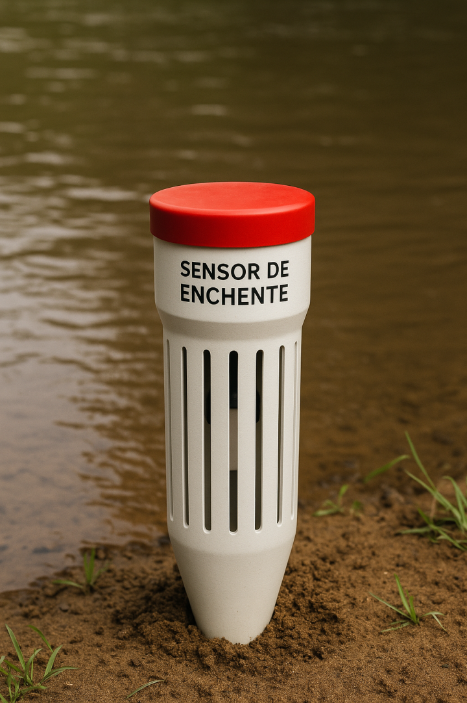

# Projeto: [RiverSafe]

## 📝 Descrição do Problema
O projeto RiverSafe surge como uma resposta inovadora ao crescente desafio das enchentes urbanas. Por meio de um dispositivo acessível, de baixo custo e tecnologicamente avançado, a iniciativa visa ampliar a capacidade de monitoramento e resposta em áreas de risco. A proposta é oferecer um sistema preciso e de amplo alcance, capaz de antecipar cenários de inundação e apoiar ações de evacuação e preparação, contribuindo diretamente para a preservação de vidas e a redução de danos materiais.

---

## 💡 Visão Geral da Solução
### 🛠 Componentes Utilizados:
- Arduino Uno
- Sensor de Umidade do Solo
- LED
- Buzzer
- Resistor
- Jumpers e Protoboard

### 🖼 Ilustração da Solução:

---

## 🔧 Instruções de Montagem e Funcionamento
1. Conecte o sensor de umidade à porta A0.
2. O LED será acionado quando o solo estiver seco.
3. O buzzer irá tocar se o nível de umidade for muito baixo.

---

## 🧪 Simulação do Projeto

### 👉 Wokwi:
- Link direto: [Abrir no Wokwi]((https://wokwi.com/projects/432962548923110401))

---

## ▶️ Vídeo Demonstrativo
[(https://youtu.be/klh_VZ6_kas)](https://youtu.be/klh_VZ6_kas)

---

## 📁 Arquivos do Projeto
- `código.ino` – Código-fonte do Arduino
- `diagrama.png` – Imagem do circuito
- `README.md` – Documentação
